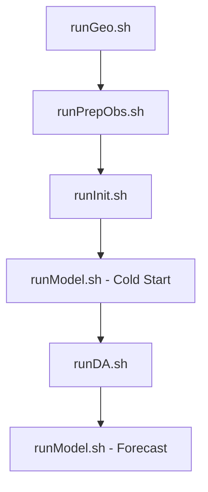
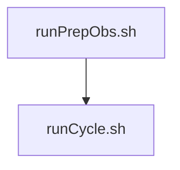

# 🚀 MPAS-JEDI Workflow

Scripts para automatizar a preparação, assimilação de dados e execução do **MPAS-JEDI**, simplificando a realização de experimentos de previsão numérica do tempo com assimilação de dados.

---

## 📋 Conteúdo

- [Requisitos](#-requisitos)
- [Instalação](#-instalação)
- [Fluxo de Execução](#-fluxo-de-execução)
- [Execução Completa do Ciclo](#-execução-completa-do-ciclo)
- [Workflow](#-workflow)
- [Observações](#-observações)
- [Autor](#-autor)

---

## 📋 Requisitos

- Linux
- Git
- MPAS-JEDI previamente compilado
- Mesmo ambiente utilizado para compilar o MPAS-JEDI

---

# 📦 Instalação

## 1. Defina o diretório de trabalho

```bash
export HOMEP=/p/projetos/monan_das/${USER}
```

Defina o diretório onde o MPAS-JEDI foi compilado, exemplo:

```bash
export BUILDDIR=${HOMEP}/Packages/builds/build_3.0.2_myenv
```

## 2. Clone o repositório

```bash
cd ${HOMEP}

git clone https://github.com/edervendrasco/mpas_jedi_wf.git

cd mpas_jedi_wf/scripts
```

## 3. Crie a estrutura de diretórios

```bash
./create_structure.sh ${HOMEP} ${BUILDDIR}
```

## 4. Carregue o ambiente do JEDI

Antes de executar qualquer script, carregue exatamente o mesmo ambiente utilizado durante a compilação do MPAS-JEDI.

> [!IMPORTANT]
> O ambiente deve ser carregado antes da execução dos scripts.

---

# ▶️ Fluxo de Execução

Todos os scripts possuem ajuda integrada.

```bash
./nome_do_script.sh
```

## Preparação da grade

Executado apenas uma vez para cada configuração de grade e dados estáticos.

```bash
runGeo.sh {argumentos}
```

## Preparação das observações

```bash
runPrepObs.sh {argumentos}
```

## Pré-processamento do MPAS

```bash
runInit.sh {argumentos}
```

## Inicialização fria (Cold Start)

Necessária apenas para o primeiro ciclo.

```bash
runModel.sh {argumentos}
```

## Assimilação de Dados

```bash
runDA.sh {argumentos}
```

## Previsão

```bash
runModel.sh {argumentos}
```

---

# 🔄 Execução Completa do Ciclo

Também é possível executar todo o fluxo (exceto a preparação das observações) através de:

```bash
runCycle.sh {argumentos}
```

O `runCycle.sh` executa automaticamente:

1. `runInit.sh`
2. `runDA.sh`
3. `runModel.sh`

> [!WARNING]
> O `runCycle.sh` **não executa** `runPrepObs.sh`. A preparação das observações deve ser realizada previamente.

---

# 📊 Workflow



Para ciclos operacionais:



---

# 📑 Scripts

| Script | Função |
|---------|--------|
| `create_structure.sh` | Cria a estrutura de diretórios do projeto |
| `runGeo.sh` | Configura grade e dados estáticos |
| `runPrepObs.sh` | Prepara as observações |
| `runInit.sh` | Pré-processa o MPAS |
| `runDA.sh` | Executa a assimilação de dados (JEDI) |
| `runModel.sh` | Executa o MPAS |
| `runCycle.sh` | Executa automaticamente o ciclo completo |

---

# 📝 Observações

- `runGeo.sh` normalmente é executado apenas uma vez para cada configuração de grade.
- `runPrepObs.sh` deve ser executado sempre que houver novas observações.
- Todos os scripts possuem ajuda integrada quando executados sem argumentos.
- É necessário utilizar sempre o mesmo ambiente empregado na compilação do MPAS-JEDI.

---

# 👤 Autor

**Éder Vendrasco**

Grupo de Desenvolvimento em Assimilação de Dados (GDAD/CPTEC)

Instituto Nacional de Pesquisas Espaciais (INPE)

